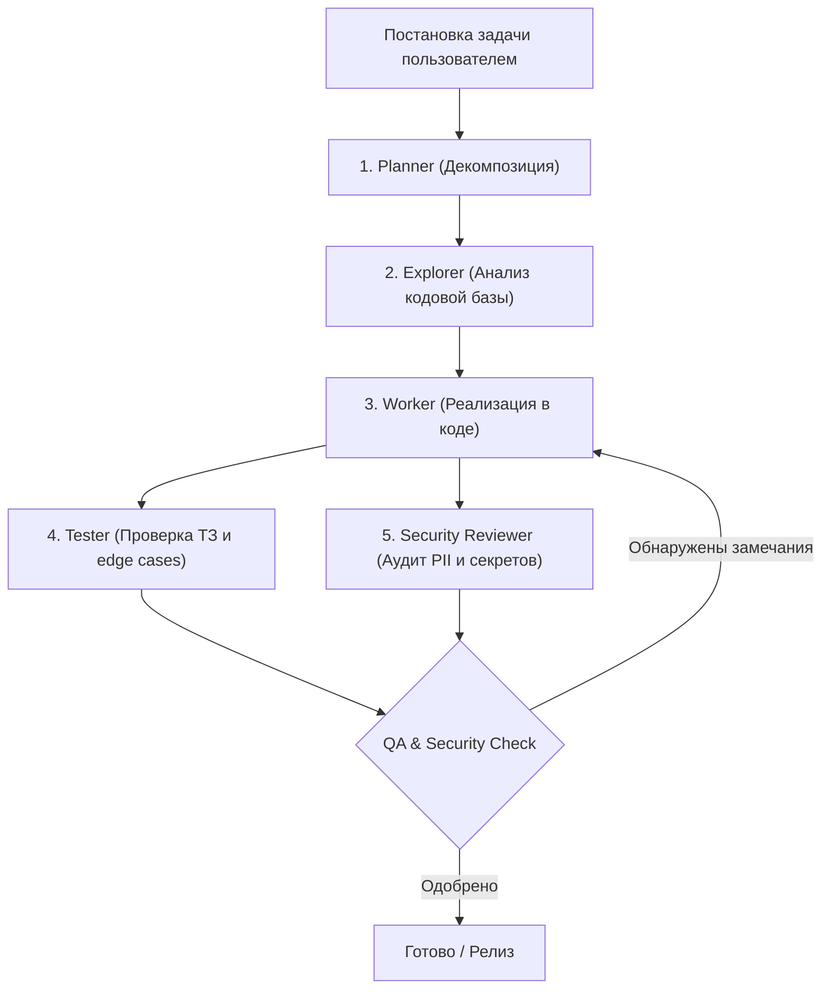

# Субагенты и Регламент разработки (Multi-Agent Team)

В проекте настроена ролевая модель субагентов для безопасной и качественной разработки:

| Субагент | Роль | Права | Обязанности |
| :--- | :--- | :---: | :--- |
| **Planner** | Архитектор / Аналитик | Read-Only | Декомпозиция задач на технические шаги, стратегия реализации, определение критериев приемки. |
| **Explorer** | Исследователь кода | Read-Only | Анализ связей в кодовой базе, поиск импортов, зависимостей и скрытых сайд-эффектов. |
| **Worker** | Разработчик / Исполнитель | **Write** | **Единственный агент с правами на запись**. Реализует код строго по плану, соблюдает запрет на PII. |
| **Tester** | QA Инженер | Read-Only | Валидация кода на соответствие ТЗ, проверка граничных сценариев, типов и автотестов. |
| **Security Reviewer** | Офицер безопасности | Read-Only | Аудит на утечки персональных данных (номера телефонов, имена), токенов, секретов и уязвимостей. |

---

## Пайплайн работы над фичами и багфиксами

### 1. Planner (Read-Only)
- Принимает задачу и декомпозирует её на атомарные шаги.
- Формулирует требования к реализации, граничные условия и критерии готовности (DoD).

### 2. Explorer (Read-Only)
- Исследует существующую кодовую базу.
- Находит все затрагиваемые файлы, хуки, типы данных и утилиты.
- Предоставляет Worker карту зависимостей.

### 3. Worker (Write)
- Единственный агент с инструментами модификации файлов и исполнения команд.
- Строго соблюдает дизайн-систему проекта (стили MAX, акцент `#5b5ce2`).
- **Категорический запрет на реальные данные:** В моках, плейсхолдерах и тестах используются только синтетические значения (`+7 (999) 123-45-67`, `dummy_token`).
- Выполняет компиляцию TypeScript и запуск тестов (`npm test`).

### 4. Tester (Read-Only)
- Проверяет полноту покрытия тестами, граничные условия (пустые данные, сетевые ошибки, лимиты).
- Формирует список найденных дефектов для Worker.

### 5. Security Reviewer (Read-Only)
- Сканирует все измененные файлы на:
  - Персональные данные (PII): реальные номера телефонов, имена, email.
  - Утечки секретов: API токены, ключи, креды.
  - Уязвимости фронтенда: XSS, небезопасное хранение, валидация входящих вебхуков.
- Выносит вердикт: **APPROVED** или **REJECTED** (блокер).
